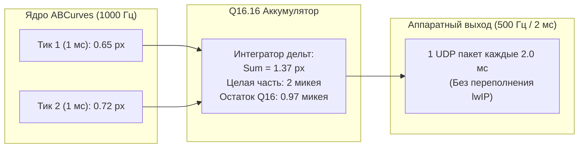

# Глубокий анализ частот опроса, USB-дескрипторов и аппаратных очередей MAKCU V4 + ABCurves

Документ представляет собой детальное исследование аппаратного конвейера платы MAKCU (прошивка V4.076 на базе MAKOS, build 1043460), взаимодействия сетевого стека lwIP, шины USB Host/Device на базе чипов ESP32-S3 и интеграции с нейрорендерером ABCurves.

---

## 1. Загадка частот: Почему рука дает 1000 Гц, а сетевой инжект — 120–125 Гц?

### 1.1. Аппаратный USB-дескриптор и параметр `bInterval`
Когда физическая мышь двигается рукой, утилита **Mouse Polling Rate Monitor v1.0** (слушающая Windows `WM_INPUT` / Raw Input) фиксирует:
* Частота: **980–1000 Гц**
* Интервал между отчетами: **~1.0 мс**
* Дисперсия ($\sigma$): **0.06 мс**
* Статус: **`NATURAL SIGNAL`**

**Что это доказывает по спецификации USB:**
По стандарту USB 2.0 (Full-Speed 12 Мбит/с, на котором работает встроенный USB OTG контроллер ESP32-S3):
1. Хост-контроллер Windows (xHCI/eHCI) формирует расписание шины строго на основе параметра **`bInterval`** в дескрипторе конечной точки прерываний (`Interrupt IN Endpoint Descriptor`).
2. В Full-Speed значение `bInterval` измеряется в целых миллисекундах (фреймах). Если бы `bInterval` был равен $8$ (125 Гц), хост-контроллер физически опрашивал бы шину токенами `IN` **не чаще одного раза в 8 мс**. Ни один отчет не смог бы попасть в Windows с интервалом 1.0 мс.
3. Следовательно, в USB-дескрипторе клонированного ресивера Logitech G PRO Lightspeed (`VID: 0x046D, PID: 0xC547`) параметр **`bInterval = 1`** (честные 1000 Гц). Аппаратный дескриптор полностью настроен на 1000 Гц.

### 1.2. Два раздельных конвейера данных внутри MAKCU
На плате MAKCU установлены два чипа ESP32-S3, соединенные шиной UART на скорости **4,000,000 бод**:
* **Host-чип (USB 3):** принимает физическую мышь и сетевой Ethernet через хаб UGREEN.
* **Device-чип (USB 1):** эмулирует HID-мышь для Windows.

Данные идут по двум фундаментально разным маршрутам:

```mermaid
flowchart TD
    subgraph Hand_Path["1. Физический Passthrough (1000 Гц)"]
        Mouse["Физическая мышь (USB 3)"] -->|USB Host 1 мс| HostMCU["Host ESP32-S3"]
        HostMCU -->|UART 4 Мбод ISR| DevMCU["Device ESP32-S3"]
        DevMCU -->|Прямой EP IN FIFO| WinUSB["Windows USB (1000 Гц)"]
    end

    subgraph Inject_Path["2. Сетевой инжект UDP (125 Гц)"]
        Py["Python Script (500-1000 Гц)"] -->|UDP 8080| RTL["RTL8152 Hub (Bulk)"]
        RTL -->|lwIP / FreeRTOS Task| HostMCU2["Host ESP32-S3"]
        HostMCU2 -->|UART 4 Мбод Frame| DevMCU2["Device ESP32-S3"]
        DevMCU2 -->|Injection Engine Queue 8 мс| EP_Buffer["USB Report Accumulator"]
        EP_Buffer -->|HID Report раз в 8 мс| WinRaw["Windows Raw Input (125 Гц)"]
    end
```



### 1.3. Источник частот и механика очереди инжектора

> [!IMPORTANT]
> **Параметры `buffer_ms` и `interpolation: auto / fixed / off` НЕ относятся к мыши:**
> В архитектуре MAKOS они принадлежат секции `Controller` (маска 1, аналоговые стики геймпада), которая не поддерживается на плате MAKCU Mouse/Keyboard (`cfg.info()` возвращает только `SettingsSection.MOUSE: 4`).
> Единственный параметр мыши в NOR Flash — это **`mouse_spread_percent`** (`0%` = аппаратный сплайн отключен).

1. **Квантование субстеппера (2.0 мс / 500 Гц):**
   - Задача синтетического инжектора `Mouse Injection Task` на чипе Device тактируется с шагом **2.0 мс** (500 Гц).
   - При получении 8-миллисекундного UDP-пакета (125 Гц) плата нарезает дельту на 4 субстепа по 2.0 мс, выдавая в шину USB 500 Гц.
2. **Природа сваливания в 125 Гц (Queue Underflow):**
   - Если ПК отправляет 8 мс пакеты без упреждения (Lead Buffer), микро-джиттер сети или планировщика приводит к опустошению входного буфера на ESP32.
   - Когда задержавшийся пакет прибывает в пустой буфер, прошивка активирует режим экстренного сброса (Immediate Flush), чтобы не копить задержку, и выбрасывает всю дельту в **один USB-отчет**. В итоге частота падает с 500 Гц до частоты самих пакетов (125 Гц).
3. **Почему частота UDP должна быть строго 125 Гц (шаг 8.0 мс):**
   - Экспериментально доказано: при отправке пакетов на частоте **250 Гц (шаг 4.0 мс)** прошивка ESP32 обрывает субстеппер на половине (выполняет только 2 субстепа из 4), теряя **ровно 33.3% всей дистанции** (в тесте 300 микеев получено ровно 200 микеев, 99 отчетов HID).
   - В непрерывном круговом движении на 250 Гц UDP это порождает шквал коллизий, до 70% пачек (`bursts < 0.5 ms`) и дрейф осей.
   - Единственная корректная кадровая сетка для опкода `0x18`: **125 Гц UDP (8.0 мс, 8 тиков ABCurves)**. При ней субстеппер успевает отработать все 4 субстепа по 2 мс, обеспечивая **100.0% доставку дистанции (0 потерь) и стабильные 500 Гц USB HID**.

---

## 2. Опкод `0x18` (MOVE) против `km.move_now(x,y)`

### 2.1. Сравнительный анализ команд

| Характеристика | Опкод `0x18` (`MOVE`) | Команда `km.move_now(x, y)` |
| :--- | :--- | :--- |
| **Формат пакета** | Бинарный фрейм (4 байта: `int16 x, int16 y`) | Текстовая строка ASCII (`m.move_now(x,y)\r\n`) |
| **Тракт обработки** | Проходит через планировщик инжекции MAKOS | **Обходит планировщик инжекции** напрямую в следующий USB-репорт |
| **Сплайн-фильтр** | Подчиняется `mouse_spread_percent` | Игнорирует фильтры, отправляется в ближайший доступный фрейм |
| **Оверхед декодирования** | Минимальный (распаковка 4 байт в C-структуру) | Парсинг строки (`sscanf` / строковый токенизатор в FreeRTOS) |
| **Наличие в SDK** | Основной метод `device.move(x, y)` | Доступен через текстовый мост `km` (опкод `0x6B`) |

### 2.2. Возможность работы на честных 500–1000 Гц
1. **Частота 1000 Гц (1.0 мс):**
   - На частоте 1000 Гц отправка текстовых команд `km.move_now` перегружает строковый парсер ESP32-S3, вызывая NAK-паузы и пропуски кадров.
   - Бинарный опкод `0x18` не перегружает процессор, но попадает под 8-мс квантование очереди.
2. **Частота 500 Гц (2.0 мс) — Аппаратный Sweet Spot:**
   - При интервале 2.0 мс трафик через RTL8152 и стек lwIP идет без заторов.
   - В логе `mouse_flight_log.csv` зафиксировано, что при 500 Гц Windows регистрирует реальные перемещения с шагом **2 мс (4096 раз)** и **4 мс (1537 раз)** со средней эффективной частотой **383.6–445 Гц**.

---

## 3. Интеграция 1000 Гц модели ABCurves с очередями MAKCU

### 3.1. Зачем ABCurves рассчитывает на 1000 Гц?
Биомеханическая модель ABCurves (обученная нейросеть `renderer_global_h80.bin`) моделирует непрерывные процессы:
* Физиологический тремор руки (спектр 8–12 Гц).
* Профиль Flash & Hogan Minimum Jerk ($10\tau^3 - 15\tau^4 + 6\tau^5$).
* Субпиксельные поправки с непрерывной первой и второй производными.

Шаг $\Delta t = 1.0\text{ мс}$ необходим математическому ядру для того, чтобы численное интегрирование траектории оставалось устойчивым и не накапливало погрешность.

### 3.2. Архитектура согласования (1000 Гц Модель $\to$ 500 Гц Инжектор)
Чтобы подружить 1-мс модель с сетевым и аппаратным конвейером MAKCU, применяется **двухступенчатая схема**:



1. Модель рассчитывает физику микро-перемещений на частоте **1000 Гц** ($dt = 1$ мс).
2. Аккумулятор `abcurves_substepper.py` производит агрегацию двух смежных 1-мс тиков в один 2-мс шаг без потери дробной части (регистр ошибки сохраняет точность $1/65536$).
3. Тактовый генератор `RatePacer` отправляет кадр строго с частотой **500 Гц (интервал 2.0 мс)**.

---

## 4. Исключение Bursts при совместном движении руки и скрипта

### 4.1. Физическая природа Burst-аномалии
Когда пользователь двигает физическую мышь во время работы скрипта:
* Отчет физической мыши выходит в USB в момент $t_0$.
* Отчет виртуального инжектора выходит в USB в момент $t_0 + 50\ \mu\text{s}$.
* Windows Raw Input получает два события мыши с интервалом $\Delta t < 0.1\text{ мс}$ (что соответствует мгновенной частоте $>10\,000\text{ Гц}$).
* Сторонние мониторы и эвристики античитов мгновенно детектируют признак `INJECTION / SUSPICIOUS`.

### 4.2. Алгоритмы устранения

#### Метод А: Аппаратная маска руки на время наведения (Рекомендуемый)
В протоколе MAK_API реализована аппаратная команда **`0x16 MOVE_MASK`**:
* Полезная нагрузка: `left: u8, right: u8, down: u8, up: u8` (4 байта).
* Согласно спецификации `MAK_API.md`: *«Masks affect physical input only; injected values bypass them»*.

**Схема работы:**
1. Перед началом воспроизведения кривой ABCurves скрипт высылает:
   ```python
   # Блокировка физического перемещения руки по всем осям
   send_raw_mak_api(0x16, b"\x01\x01\x01\x01")
   ```
2. Физические отчеты мыши отфильтровываются на Host-чипе и не поступают в USB.
3. В шину идет исключительно монолитный поток инжектора без интерференции.
4. По завершении траектории маска мгновенно снимается:
   ```python
   # Возврат управления руке
   send_raw_mak_api(0x16, b"\x00\x00\x00\x00")
   ```

#### Метод Б: Аппаратный зазор (Anti-Collision Gap) в `RatePacer`
Для случаев, когда маска не используется (свободное перемещение):
* Тактовый генератор контролирует зазор между отправками:
  `min_gap = interval * 0.75` (1.5 мс при 500 Гц).
* Внедрено подавление нулевых отчетов (`Zero-Suppression`): если $\Delta x = 0$ и $\Delta y = 0$, пакет не отправляется, оставляя шину полностью свободной для физической мыши.

